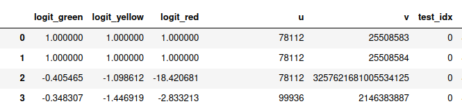
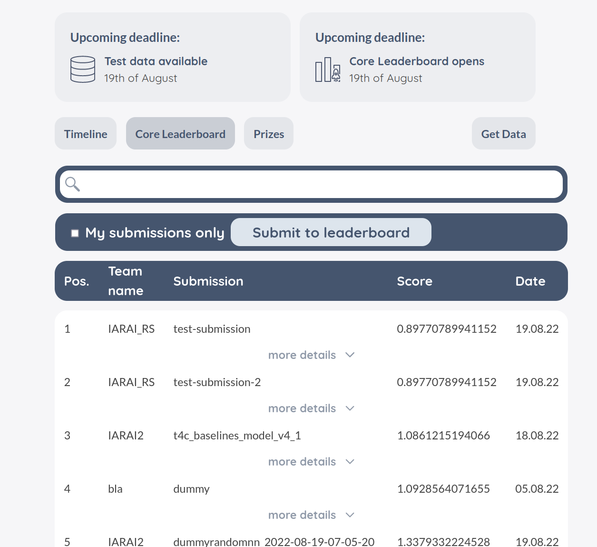
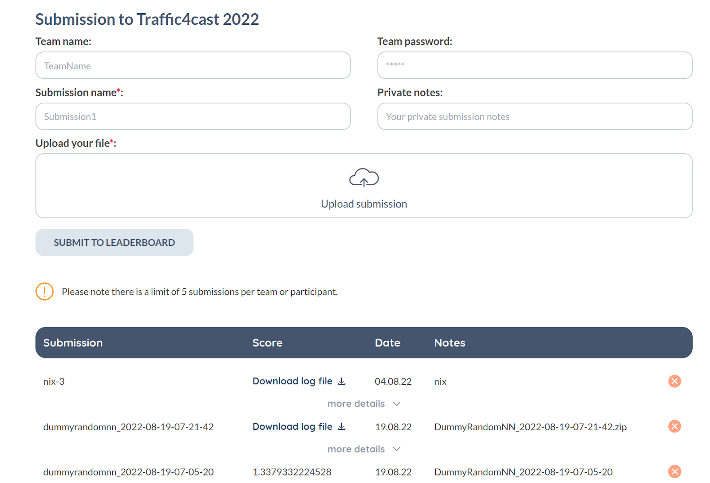

2022-09-18 The leaderboard for the core competition t4c 2022 is open!
=====================================================================
https://www.iarai.ac.at/traffic4cast/forums/topic/the-leaderboard-for-the-core-competition-t4c-2022-is-open/

Test set
--------
For the core competition, we will use the files  `test/london/input/counters_test.parquet` etc. already contained in the original data zip [T4C_INPUTS_2022.zip](https://iarai-public.s3-eu-west-1.amazonaws.com/competitions/t4c/t4c22/T4C_INPUTS_2022.zip)

We will restrict evaluation to a subset 6am-10pm from all days of the week (including weekends).

However, all data can be used for training.

Submissions
-----------
The submission zip for the core competition must have the following file structure:

    london/labels/cc_labels_test.parquet
    madrid/labels/cc_labels_test.parquet
    melbourne/labels/cc_labels_test.parquet

The parquet files must contain `logit_green`/`logit_yellow`/`logit_red` for every edge `u`,`v` and test slot `test_idx`.

See [README_DATA_SPECIFICATION.md](https://github.com/iarai/NeurIPS2022-traffic4cast/blob/main/README_DATA_SPECIFICATION.md)  for the details.

To get started, adapt [t4c22/evaluation/create_submission_template.py](https://github.com/iarai/NeurIPS2022-traffic4cast/blob/main/t4c22/evaluation/create_submission_template.py) to your purposes

Evaluation
----------
Evaluation uses `torch.nn.CrossEntropyLoss` to evaluate your submissions, see also [README#Metric](https://github.com/iarai/NeurIPS2022-traffic4cast#metric)

    class_weights = get_weights_from_class_fractions([class_fractions[city][c] for c in ["green", "yellow", "red"]])
    # shifting from range 0=undefined, 1=green/uncongested, 2=yellow/slowed-down, 3=red/congested,
    # so we can use y as index into the 3 logits coming from the model and ignore_index=-1
    y = y.nan_to_num(-1).long()
    loss_f_weighted = torch.nn.CrossEntropyLoss(weight=torch.tensor(class_weights).float(), ignore_index=-1)

Upload your submissions on https://www.iarai.ac.at/traffic4cast/challenge/

The evaluation runs twice an hour. If evaluation fails, you can download the log file. Please contact us if there is a problem so we can improve the error handling and documentation.

See code under [t4c22/evaluation](https://github.com/iarai/NeurIPS2022-traffic4cast/blob/main/t4c22/evaluation/)

Changes to the repo
-------------------
There are some small patches to the dataset classes to allow for reading the inputs for the set only (returning None for the labels).

Need support?
-------------
Have a look at https://github.com/iarai/NeurIPS2022-traffic4cast/issues
