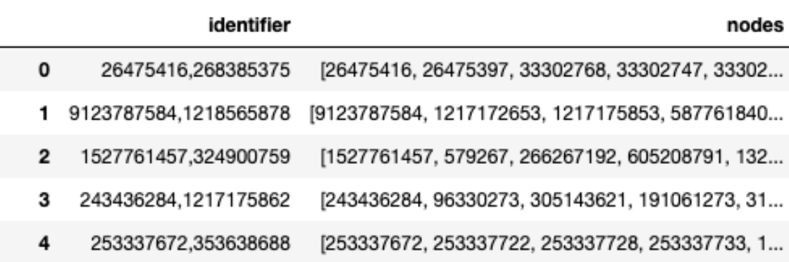

The leaderboard for the extended competition on ETA of t4c 2022 is open!
========================================================================
https://www.iarai.ac.at/traffic4cast/forums/topic/the-leaderboard-for-the-extended-competition-on-eta-of-t4c-2022-is-open/

Supersegments and ETAs
----------------------

Labels in the extended competition are travel times (or Expected Time of Arrival, ETA) for supersegments. Supersegments are paths in the underlying road graph:



There is never more than one supersegment per origin-destination pair.

We sampled supersegments for the same 3 cities as in the core competition:

| city      | #supersegments | #edges  |
|-----------|----------------|---------|
| London    | 4’012          | 132’414 |
| Madrid    | 3’969          | 121’902 |
| Melbourne | 3’246          | 94’871  |

The dynamic speed data (GPS probes) is used to derive travel times on the edges of the graph and then summed up to supersegment ETAs.
This is compatible with how industry-standard routing engines are deriving their segment speeds.

The use of supersegments is motivated by contraction hierarchies, which are a common strategy in most commercial routing engines.
Also, the use of supersegments helps to make the ETAs derived from the underlying speed data more robust to data outliers.
At test time we provide only the loop counter input.

The derivation of supersegments gives high weight to important road segments, as can bee seen from the picture below. By sampling key intersection nodes (triangles) and then routing between pairs of them with some stopping criterion (blue-purple, reflecting different numbers of nodes with loop counters on the supersegment), the same edge (green box) can appear in multiple supersegments (yellow).


In a subsequent blog post, we will provide more details on the derivation of supersegments and ETAs on supersegments.

References:
* [Geisberger et al., Contraction Hierarchies: Faster and Simpler Hierarchical Routing in Road Networks](https://link.springer.com/chapter/10.1007/978-3-540-68552-4_24)
* [Derrow-Pinion et al., ETA Prediction with Graph Neural Networks in Google Maps](https://arxiv.org/abs/2108.11482)

Download Data and Generate Labels
----------------------------------

In addition to the original [T4C_INPUTS_2022.zip](https://iarai-public.s3-eu-west-1.amazonaws.com/competitions/t4c/t4c22/T4C_INPUTS_2022.zip), you will need
to download [T4C_INPUTS_ETA_2022.zip](https://iarai-public.s3-eu-west-1.amazonaws.com/competitions/t4c/t4c22/T4C_INPUTS_ETA_2022.zip) and extract to data folder:

    road_graph/london/road_graph_supersegments.parquet
    road_graph/madrid/road_graph_supersegments.parquet
    road_graph/melbourne/road_graph_supersegments.parquet

As for the core competition, you will need to generate the labels from the dynamic data using [t4c22/prepare_training_data_eta.py](https://github.com/iarai/NeurIPS2022-traffic4cast/blob/main/t4c22/prepare_training_data_eta.py), see [README#Generate Labels](https://github.com/iarai/NeurIPS2022-traffic4cast#generate-labels)

Test set
--------
For the extended competition, we will use the same test files  `test/london/input/counters_test.parquet` etc. as for the core competition, already contained in the original data zip T4C_INPUTS_2022.zip.

Naive Baseline
---------------

We provide [exploration/eta_exploration.ipynb](https://github.com/iarai/NeurIPS2022-traffic4cast/blob/main/exploration/eta_exploration.ipynb), which explores the supersegment ETA values and provides a simple baseline to generate a submission. The baseline logic uses the total volume of all inputs (loop counter values) in a 15 minute input frame to assign the frame to one of 10 classes (clustered intervals of volume). These 10 cluster classes can be seen as a signal of total traffic load in the city. The ETAs per supersegment are aggregated (median) in these 10 classes. The resulting map can then be used to lookup the ETAs for the test data.

Of course, this baseline does not take into account local effects and should be easy to beat with more sophisticated approaches. Also, as supersegments are paths in the underlying graph, it will be interesting to see whether approaches using joint training on both competition data will be successful.

Evaluation
----------

We use L1 Loss for the extended competition. Notice that in contrast to the core competition, there is no "evaluation mask", i.e. all supersegments have an ETA label.

References:
* [Elmasri, Beyond L2 Loss — How we experiment with loss functions at Lyft](https://eng.lyft.com/beyond-l2-loss-how-we-experiment-with-loss-functions-at-lyft-51f9303f5d2d)
* [Schleibaum et al., An Explainable Stacked Ensemble Model for Static Route-Free Estimation of Time of Arrival](https://arxiv.org/abs/2203.09438)
*  [Derrow-Pinion et al., ETA Prediction with Graph Neural Networks in Google Maps](https://arxiv.org/abs/2203.09438)

Changes to the Repo
----------------------

In addition to the label generation and evaluation code, we’ve modified the dataset implementations to load the ETA labels and the supersegment-to-segment mapping, which allows to derive supersegment labels from edge data.
Finally, we provide [t4c22/prepare_training_check_labels.py](https://github.com/iarai/NeurIPS2022-traffic4cast/blob/main/t4c22/prepare_training_check_labels.py) to sanity check the generated labels are correct.

```
python t4c22/prepare_training_check_labels.py -d ....../data -c eta
/ start extended competition check
london: 100%|███████████████████████████████████████████████████████████████████████████████████████████████████████████████████████████████████████████████████████████████████████████████████████████████████████████████████████████████████████████████████████████████████████████████████████████████████████| 110/110 [00:14<00:00,  7.44it/s]

(✓) eta sum check london
madrid: 100%|███████████████████████████████████████████████████████████████████████████████████████████████████████████████████████████████████████████████████████████████████████████████████████████████████████████████████████████████████████████████████████████████████████████████████████████████████████| 109/109 [00:14<00:00,  7.68it/s]

(✓) eta sum check madrid
melbourne: 100%|████████████████████████████████████████████████████████████████████████████████████████████████████████████████████████████████████████████████████████████████████████████████████████████████████████████████████████████████████████████████████████████████████████████████████████████████████| 108/108 [00:11<00:00,  9.36it/s]

(✓) eta sum check melbourne

{"london": 14940784306.865265, "madrid": 13610842992.839174, "melbourne": 7184138390.886184}
\ end extended competition check -> OK!


Summary:
(✓) eta sum check london
(✓) eta sum check madrid
(✓) eta sum check melbourne
All checks succesful!
```
