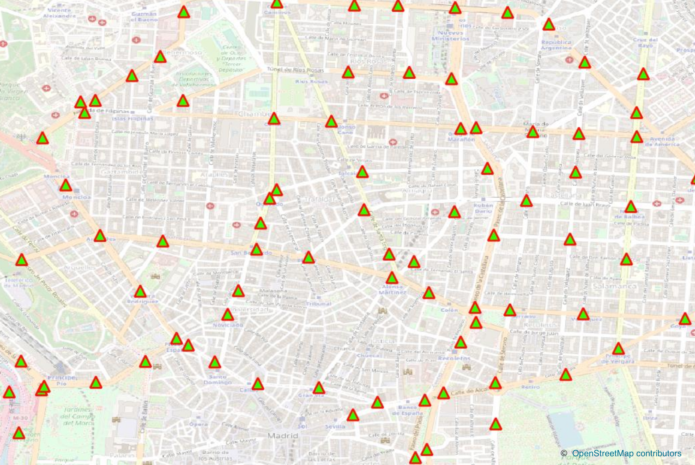
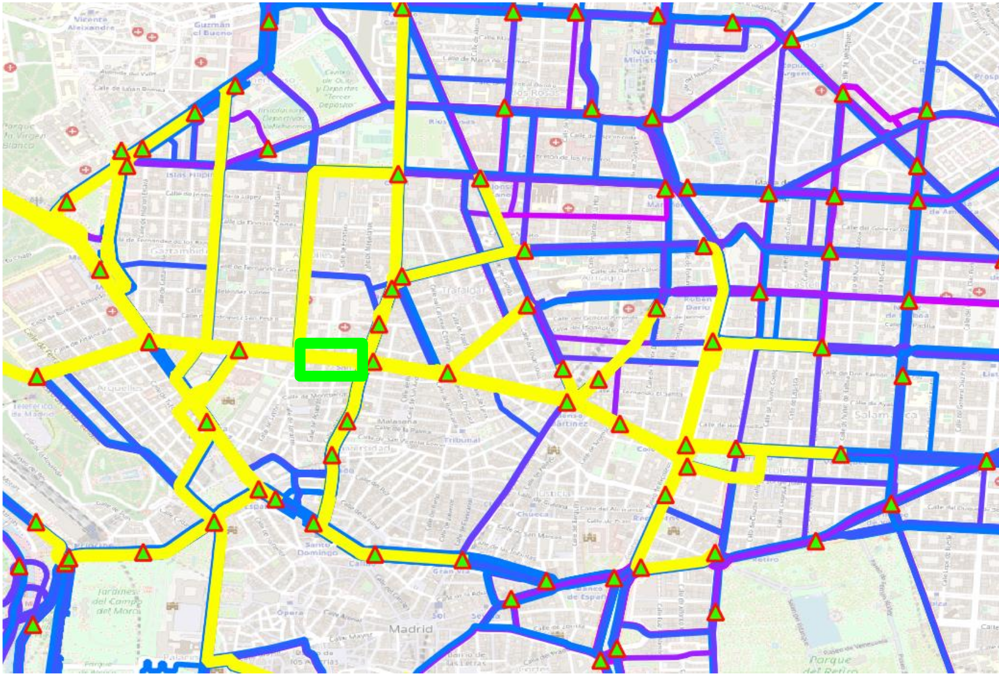
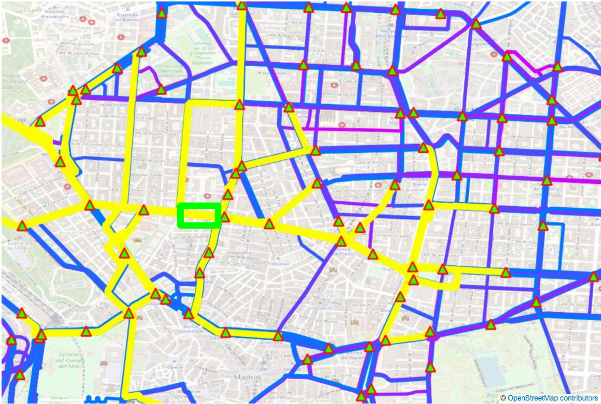
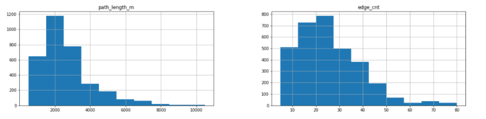
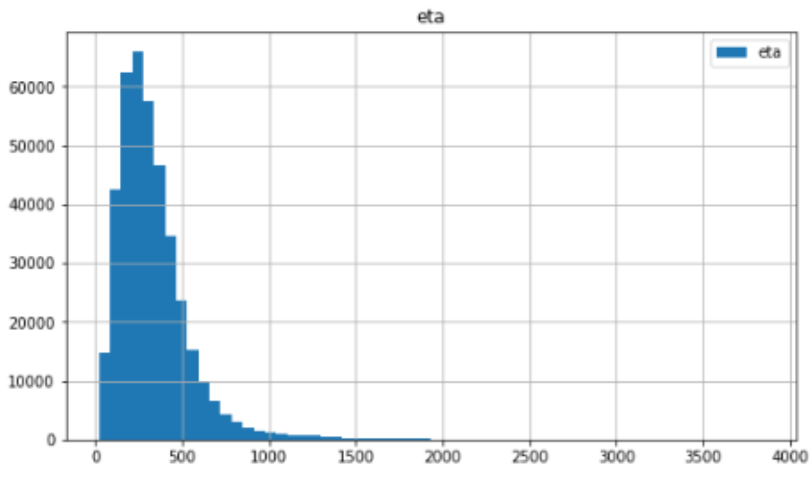
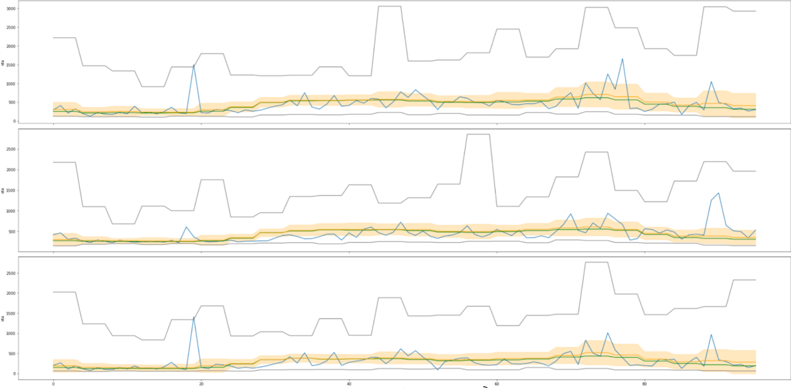

Introduction
============
Predicting ETAs (Estimated Time of Arrival) is a highly important topic in industry. We use the Traffic Map Movies based on dynamic speed data (GPS probes) from HERE to derive travel times
on the edges of our simplified OSM road graph in 3 cities (London, Madrid, Melbourne). This is compatible with segment speeds used in industry-standard routing engines.
The use of supersegments is motivated by contraction hierarchies, which are a common strategy in most commercial routing engines. Also, due to their length, the use of supersegments
helps to make the ETAs derived from the underlying speed data more robust to data outliers.
In the extended competition of Traffic4cast 2022 (eta), we use publicly available vehicle counter data on a subset of the nodes of the road graph as input.
These counts are the only input we provide at test time. Of course, additional hand-designed or learnt data can be used as additional features on nodes or
edges.

Supersegments
=============
In each city, we start by choosing approximately 400 connected key intersections, based on maximum daily volume and by OSM importance (i.e. road class) as shown in the following picture:

By sampling the 10 nearest neighbors at a distance greater 500 meters and routing between those key intersections, we find supersegments between pairs of key intersections:

The derivation of supersegments gives high weight to important road segments, as can bee seen from the picture below. By sampling key intersection nodes (triangles) and then routing between pairs of them with some stopping criterion
(blue-purple, different colors reflecting different numbers of nodes with loop counters on the
supersegment), the same edge (green box) can appear in multiple supersegments (yellow).

Supersegments are typically about 2 km long, e.g. for Madrid, other cities look similar:

Supersegment ETAs
=================
Segment speeds are computed from all cells intersecting the segment path (incl. angle alignment).

Super Segment ETAs are derived using the lengths and speeds from all individual segments in the Super Segment. If available the current measured speed is used
with a simple fallback to typical free flow or max speed of the segment:

    def segment_speed(edge):
        if edge in current_speeds:
            return current_speeds[edge]
        elif edge in free_flows:
            return free_flows[edge]
        else:
            return maxspeeds[edge]

Free flow speeds are derived from the traffic map movies, and max speeds are the signalled speed limits (as coming from the OpenStreetMap data).

ETAs on supersegments are typically around 5 minutes, e.g. for Madrid, other cities look similar:

In the following picture, we show the same day (2019-07-06) from the training data for 3 super segments going through same backbone segment (Marleybone Flyover)
in London. We show the 15 minute ETAs for that day and the hourly mean, std, median, min and max in the data. We see some prominent peaks in the hourly max ETAs
which must come from rare events; this is plausible as mean line is not much above the median line. We also see some some peaks in the ETAs which arise in
all 3 supersegments to different degrees, probably reflecting local congestions having various impact on the total ETA of the 3 supersegments. We also see that
the recurring patterns as coming from the hourly historical are already a good general predictor of what happens on a particular day, and it will be interesting
to see how much more information models are able to encode and extract from the vehicle count data.

The code used to produce this figure can be found [exploration/eta_exploration.ipynb](https://github.com/iarai/NeurIPS2022-traffic4cast/tree/main/exploration/eta_exploration.ipynb) and [exploration/historic_distribution.py](https://github.com/iarai/NeurIPS2022-traffic4cast/tree/main/exploration/historic_distribution.py).
