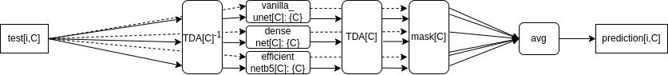

# Paper and Code Guidlines Traffic4cast 2022 (due 1st November 2022)

## Disclaimer

To collect a prize (https://www.iarai.ac.at/traffic4cast/challenge/), participants need to adhere to the competition’s
T&Cs (https://www.iarai.ac.at/traffic4cast/terms-and-conditions/). These require the publication of working solutions (including learnt parameters) as well as a
short scientific paper (ca. 4 pages) describing their approach on GitHub and arXiv, respectively.

## Guidelines for Short Scientific Paper

In order for you to guide you in writing these papers and to ensure the quality of the papers, we've compiled some guidelines and suggested ToC and some hints
on the content we'd like to find. Note that you are free to modifiy this structure according to your needs, but we hope you find it useful.

For inspiration, you can find examples from last year's review paper  (see Section 3 of https://proceedings.mlr.press/v176/eichenberger22a/eichenberger22a.pdf)
and one
example https://arxiv.org/abs/2110.14383

Preferred way of publication: arXiv.org

### Suggested Table of Contents

#### Source Code, Additional Data and Solution Models

Give the URL to your source code repository (see guidelines below).

#### Motivation

Give a brief general introduction why you chose your approach here.

#### Data Preparations

Describe additional data sources here. Describe your data preparations like positional or temporal encodings, normalizations, or hand-designed statistical
aggregations.

#### Model Architecture

Give a model architecture diagram with dataflow and dimensions. See for
instance https://stackoverflow.com/questions/52468956/how-do-i-visualize-a-net-in-pytorch

#### Training

Give details on the training pipeline here like sampling, loss function, epochs, batch sizes, optimizer, regularization, hardware used. Explain how you tackled
the problem, e.g. if you generate your own training and validation sets, data fine-tuning, layer freezing, distillation etc.

In order to compare the different approaches of the different solutions in the competition, we would like to see a table like the following (see Table 1,
Section 3 of https://proceedings.mlr.press/v176/eichenberger22a/eichenberger22a.pdf):

| model (checkpoint)            | architecture | fine-tuning/freezing           | sampling                         | size training set | training data                                     | number of iterations | batch size | trainable parameters / model size | optimizer and schedule | 
|-------------------------------|--------------|--------------------------------|----------------------------------|-------------------|---------------------------------------------------|----------------------|------------|-----------------------------------|------------------------|
| fancy_small_baseline&lt;city> | fancy_small  | --                             | 20 days per &lt;city>, whole day | 20 * 96           | e.g. (4,10) tensor per node, (4,) tensor per edge | 50 epochs            | 1          | 1.2K                              | AdamA                  |
| fancy_big                     | fancy_big    | --                             | 20 days per city, whole day      | 3 * 20 * 96       | e.g. (4,10) tensor per node, (4,) tensor per edge | 50 epochs            | 2          | 1.2M                              | AdamB                  |
| fancy_big_fine&lt;city>       | fancy_big    | fancy_big                      | 20 days per &lt;city>. whole day | 20 * 96           | e.g. (4,10) tensor per node, (4,) tensor per edge | 5 epochs             | 3          | 1.2M                              | AdamC                  |
| fancy_big_freeze&lt;city>     | fancy_big    | fancy_big with n layers frozen | 20 days per &lt;city>. whole day | 20 * 96           | e.g. (4,10) tensor per node, (4,) tensor per edge | 5 epochs             | 4          | 1.0M / 1.2M                       | AdamD                  |

#### Inference

If you use ensembling, a diagram is useful to make clear which checkpoints you used and how you ensembled. Here's an example
from https://proceedings.mlr.press/v176/eichenberger22a/eichenberger22a.pdf:

#### Discussion and Literature

Give a more detailed motivation and discussion of the choices you made and refer to the research context (literature) if possible. You need not give a full
description of the literature, but explain your contribution and put it into the picture of others’ work. Learnings, challenges, open questions, hidden
assumptions or intuitions, conjectures should go here, too. You may also give some qualitative examples and plots to illustrate the workings (and maybe also
limitations) of your approach.

## Guidelines Code and Model Checkpoint Repository

Please provide your best solution models with all the weights. You can use lfs on github or Google Drive. We can also provide you with Google Drive space - please reach out to us.

Your code repository (preferrably on `github.com`) should contain:

- source code and any additional data and pre-trained models used in the competition.
- instructions to load all code dependencies and prerequisites used in training such as additional data. Preferred way: `conda env update -f environment.yml`
  or `python -m pip install -r requirements.txt` (along with python version).
- instructions to run the code from the model checkpoints. Preferred way: `submission.py` from this repo or any other out-of-the-box script to use your best
  model to generate predictions. The script
  will read the inputs for the model from a given path and a given test folder (like the one used for the leaderboard), and save the outputs on a
  given path. The path to the folder containing the weights to be loaded by the models can also be an argument of the script.
