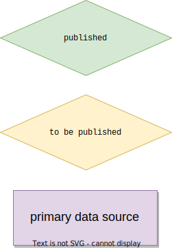
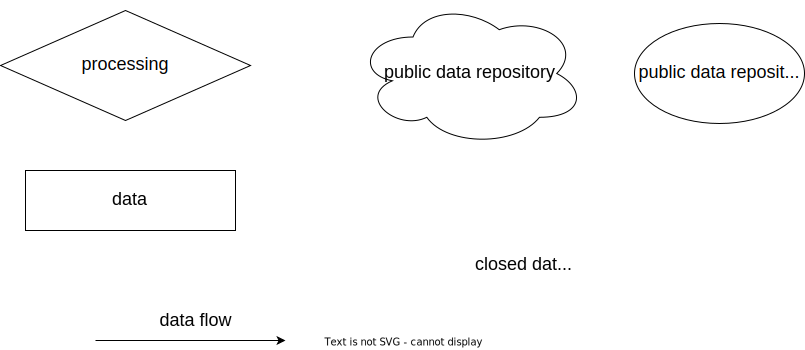
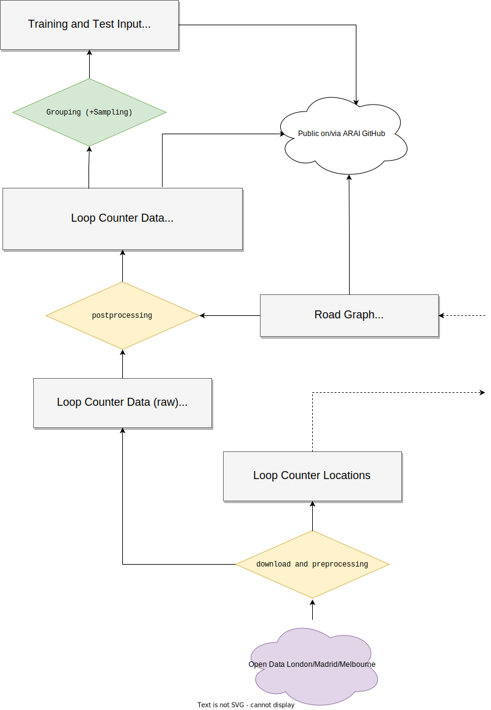
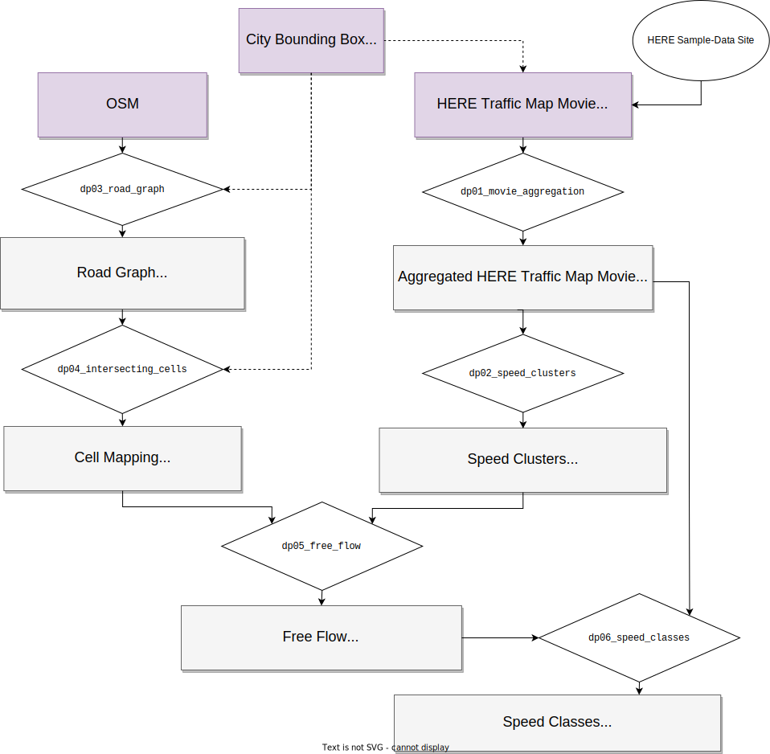

# Traffic4cast 2022 Data Pipeline

This sub-folder describes the data pipeline for Traffic4cast 2022 both for the loop counter node data and for the
edge speed classification data. The major parts of the speed classification pipeline are provided as a series of scripts
that allow to generate a road graph and derive speed classifications from available traffic movies end-to-end.

### Color Scheme


### Symbols Used



## Data Pipeline Node Data: Vehicle Counts



| Item               | Description                |
|--------------------|----------------------------|
| download and preprocessing | Download the public data, purge and transform in intermediate common data format. |
| postprocessing             | From the normalized loop counter data, join with OSM IDs. |
| Grouping (+Sampling)       | Group 4 15-minute counts for input. Sample test data.      |

### Loop Counter Data Sources

| City | Provider | Counter Locations Dataset  | Historical Counts Dataset | License |
|------|----------|----------------------------|---------------------------|----------|
| Madrid | city council (Ayuntamiento de Madrid) | [Tráfico. Ubicación de los puntos de medida del tráfico](https://datos.madrid.es/egob/catalogo/202468-0-intensidad-trafico) | [Tráfico. Histórico de datos del tráfico desde 2013](https://datos.madrid.es/egob/catalogo/208627-0-transporte-ptomedida-historico) | [Aviso Legal](https://datos.madrid.es/egob/catalogo/aviso-legal) |
| Melbourne | Department of Transport in the State of Victoria |  [Traffic Lights](https://discover.data.vic.gov.au/dataset/traffic-lights) | [Signal Volume Data](https://discover.data.vic.gov.au/dataset/traffic-signal-volume-data) | [Creative Commons Attribution 4.0 International](https://creativecommons.org/licenses/by/4.0/) |
| London  | TfL  | [TIMS detector data](https://roads.data.tfl.gov.uk/) | [TIMS detector data](https://roads.data.tfl.gov.uk/) | [Terms and Conditions Transport Data Service](https://tfl.gov.uk/corporate/terms-and-conditions/transport-data-service) |
| London  | Highways England |[Highways England network journey time and traffic flow data](https://data.gov.uk/dataset/9562c512-4a0b-45ee-b6ad-afc0f99b841f/highways-england-network-journey-time-and-traffic-flow-data) | [Traffic Flow data - Sites and Historical Reports](https://webtris.highwaysengland.co.uk/)|  [Open Government Licence](https://www.nationalarchives.gov.uk/doc/open-government-licence/version/3/) |


## Data Pipeline Edge Data: Congestion Classes from Traffic4cast Traffic Map Movies


| Item               | Description                |
|--------------------|----------------------------|
| Road Selection     | Select OSM primary features of type "highway" in the bounding box, introduce nodes for loop counters and simplify the road graph (remove dead-ends and unconnected components etc.). |
| Spatial Join       | Intersect OSM roads geometries with map movie cell geometries. |
| Combination        | Combine Traffic Map values with OSM IDs. |
| Generate CC Labels | Generate congestion classes (green=1, yellow=2, red=3) from the current segment medium speeds, the free flow speeds computed for the segment from the traffic map movies and the OSM signalled speeds. If no or not enough dynamic speed data is available, do not classify (unclassified=0). |


## Data Pipeline Edge Data: Speed Classes from Traffic4cast Traffic Map Movies


The scripts dp*.py in this sub-folder provide a fully-functional end-to-end way to derive a road graph with
speed classifications from available Traffic4cast traffic map movies as they can be downloaded from https://developer.here.com/sample-data

The scripts are numbered (dp01-06) in the order of their execution and dependency upon previous outputs.

The following diagram shows the excution dependencies and artifacts of these scripts.




### 15 minute movie aggregation (`dp01_movie_aggregation.py`)

The traffic map movie data from the Traffic4cast competitions 2020, 2021 and 2022 as provided on https://developer.here.com/sample-data
is aggregated in 5 minute bins. In order to be able to compute speed classifications in 15 minute bins this data needs
to be aggregated.

Prior to starting you should have downloaded and extracted the ZIP file for the city of interest from https://developer.here.com/sample-data
The files from the 2022 competition (LONDON_2022.zip, MADRID_2022.zip, MELBOURNE_2022.zip) will automatically extract into the
expected sub-folder structure in the data folder, e.g.
```
└── movie
    ├── london
    ├── madrid
    └── melbourne
```
For the downloads from the older competitions you might have to copy the extracted data into the appropriate sub-folder.

The output will be written to a newly created subfolder `movie_15min` inside the data folder.


### Speed clusters (`dp02_speed_clusters.py`)

The generation of congestion class labels (`t4c22/prepare_training_data_cc.py`) uses both the actual speed, and the
typical free flow speed for the road segment as input. The free flow is derived from the highest dominant speed on the
given road segment (see `dp05_free_flow.py`).

This step computes the 5 most dominant speeds clusters for every cell and heading in the aggregated 15 minute traffic
map movies. By default, all speed values from 20 days of data are clustered using the K-means clustering
algorithm for every cell/heading combination (495x436x4 = ~860K). Hence, this process is computationally expensive
and can easily take 2-3 hours per city.

Prior to starting you should have generated the 15 minute movie aggregates using the script `dp01_movie_aggregation.py`.

The script expects a subfolder `movie_15min/<city>` in the passed data_folder. The output will be written to a newly
created subfolder `movie_speed_clusters` inside the data folder.


### Road graph (`dp03_road_graph.py`)
TODO


### Intersecting cells (`dp04_intersecting_cells.py`)
TODO


### Free flow speeds (`dp05_free_flow.py`)
TODO


### Speed classification (`dp06_speed_classes.py`)
TODO
```
The script needs the following three folders in <data_folder>
├── road_graph
│   ├── london
│   ├── madrid
│   └── melbourne
└── movie_15min
    ├── london
    ├── madrid
    └── melbourne
```
