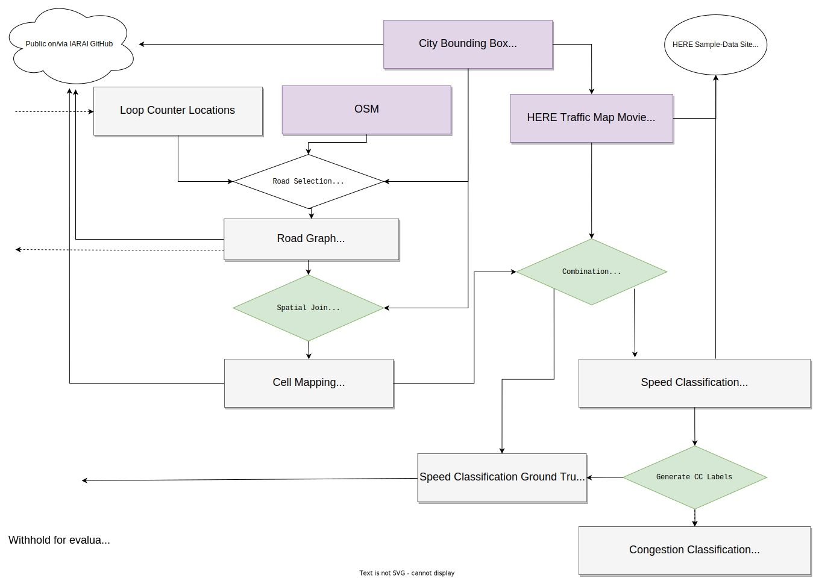

# Traffic4cast 2022 Data Pipeline

The Traffic4cast 2022 competition dataset has inspired the new dataset and pipeline called MeTS-10 (Metropolitan Segment Traffic Speeds from Massive Floating Car Data in 10 Cities). This sub-folder contains instructions on how to use https://github.com/iarai/MeTS-10 for preparing data compatible with Traffic4cast 2022.


## Static Road Graph Data

The road graph data (nodes and edges) can be prepared using the scripts from from https://github.com/iarai/MeTS-10/tree/master/data_pipeline
* `dp01_movie_aggregation.py`
* `dp02_speed_clusters.py`
* `dp03_road_graph.py`

Run `dp03_road_graph.py`  with the following custom arguments:
* `--custom_filter '["highway"~"motorway|motorway_link|trunk|primary|secondary|tertiary|unclassified|residential"]'`
* `--parse_maxspeed` (needs to be enabled for Madrid)
* `--heatmap_filter`

The output files `road_graph_nodes.parquet`, `road_graph_edges.parquet`, `road_graph.gpkg` and `road_graph.graphml` will be written to `road_graph/<city>`.

Be aware of README_DATA_SPECIFICATION.md in this repo and in MeTS-10 for minor differences in the attribute names.

## Dynamic Node Data: Vehicle Counts

### Loop Counter Data Sources

| City | Provider | Counter Locations Dataset  | Historical Counts Dataset | License |
|------|----------|----------------------------|---------------------------|----------|
| Madrid | city council (Ayuntamiento de Madrid) | [Tráfico. Ubicación de los puntos de medida del tráfico](https://datos.madrid.es/egob/catalogo/202468-0-intensidad-trafico) | [Tráfico. Histórico de datos del tráfico desde 2013](https://datos.madrid.es/egob/catalogo/208627-0-transporte-ptomedida-historico) | [Aviso Legal](https://datos.madrid.es/egob/catalogo/aviso-legal) |
| Melbourne | Department of Transport in the State of Victoria |  [Traffic Lights](https://discover.data.vic.gov.au/dataset/traffic-lights) | [Signal Volume Data](https://discover.data.vic.gov.au/dataset/traffic-signal-volume-data) | [Creative Commons Attribution 4.0 International](https://creativecommons.org/licenses/by/4.0/) |
| London  | TfL  | [TIMS detector data](https://roads.data.tfl.gov.uk/) | [TIMS detector data](https://roads.data.tfl.gov.uk/) | [Terms and Conditions Transport Data Service](https://tfl.gov.uk/corporate/terms-and-conditions/transport-data-service) |
| London  | Highways England |[Highways England network journey time and traffic flow data](https://data.gov.uk/dataset/9562c512-4a0b-45ee-b6ad-afc0f99b841f/highways-england-network-journey-time-and-traffic-flow-data) | [Traffic Flow data - Sites and Historical Reports](https://webtris.highwaysengland.co.uk/)|  [Open Government Licence](https://www.nationalarchives.gov.uk/doc/open-government-licence/version/3/) |


### Vehicle Counter Data Pipeline

Vehicle loop counter data can be processed using the pipeline used for counter validations in MeTS-10: https://github.com/iarai/MeTS-10/tree/master/analysis/val02_counters

This process requires the road graph data in `road_graph/<city>`.

* `counters01_prepare_data.ipynb`: Downloads and processes the counter readings. Outputs `loop_counters/<CITY>/counters_normalized_{month}.parquet` (this is compatbile with the files `counters_daily_by_node` referred to in the data spec)
* `counters02_match_counters.ipynb`: Merges the loop counter locations with the road graph and outputs `loop_counters/<CITY>/counters_matched.parquet`

For the road graph `counters_matched.parquet` needs to be merged with `road_graph_nodes.parquet`.
As snippet will be provided here: TODO

With this output you can use the following snippet to create loop counter inputs for the Traffic4cast setup:

```python
def combine_1h_volume(xdf):
    xdf = xdf.sort_values(['day'])
    result = []
    volumes_1h = []
    for day, volume in zip(xdf['day'], xdf['volume']):
        r = {
            'day': day,
            't': -1,
            'volumes_1h': -1
        }
        for t, v in enumerate(volume):
            volumes_1h.append(v)
            if len(volumes_1h) != 5:
                continue
            r['t'] = t
            r['volumes_1h'] = volumes_1h[:-1]
            result.append(r.copy())
            volumes_1h = volumes_1h[1:]
    return pandas.DataFrame(result)

def provision_loop_counter_input(city, month, days):
    input_parquet = f'loop_counters/<CITY>/counters_normalized_{month}.parquet'
    input_df = pandas.read_parquet(input_parquet)
    print(f'Read {len(input_df)} rows from {input_parquet}')
    input_df = input_df.reset_index()
    input_df['node_id'] = input_df['node_id'].astype('int64')
    input_df = input_df.groupby(by=['node_id']).apply(combine_1h_volume)
    input_df = input_df.reset_index()
    input_df = input_df[['node_id', 'day', 't', 'volumes_1h']]
    for day in days:
        provision_df = input_df[(input_df["day"]==day)]
        print(f' Result rows: {len(provision_df)}')
        print(f' Counters: {len(provision_df["node_id"].unique())}')
        provision_parquet = f'train/{city}/input/counters_{day}.parquet'
        provision_df.to_parquet(provision_parquet, compression='snappy')
        print(f'Wrote training input to {provision_parquet}')
```

## Dynamic Edge Data: Congestion Classes from GPS Speeds


The speed class data from MeTS-10 is compatible with the Traffic4cast 2022 process for CC labels: generate congestion classes (green=1, yellow=2, red=3) from the current segment medium speeds, the free flow speeds computed for the segment from the traffic map movies and the OSM signalled speeds. If no or not enough dynamic speed data is available, do not classify (unclassified=0).

Use the scripts from https://github.com/iarai/MeTS-10/tree/master/data_pipeline after running steps 1-3 above:
* `dp04_intersecting_cells.py`
* `dp05_free_flow.py`
* `dp06_speed_classes.py`

Run `dp05_free_flow.py`  with the following custom arguments:
* `--use_speed_limit`

Outputs of `dp06_speed_classes.py` will be stored as `speed_classes_<date>.parquet` to `speed_classes/<city>`.

With these outputs `t4c22/prepare_training_data_cc.py` can be used to generate the training labels.
